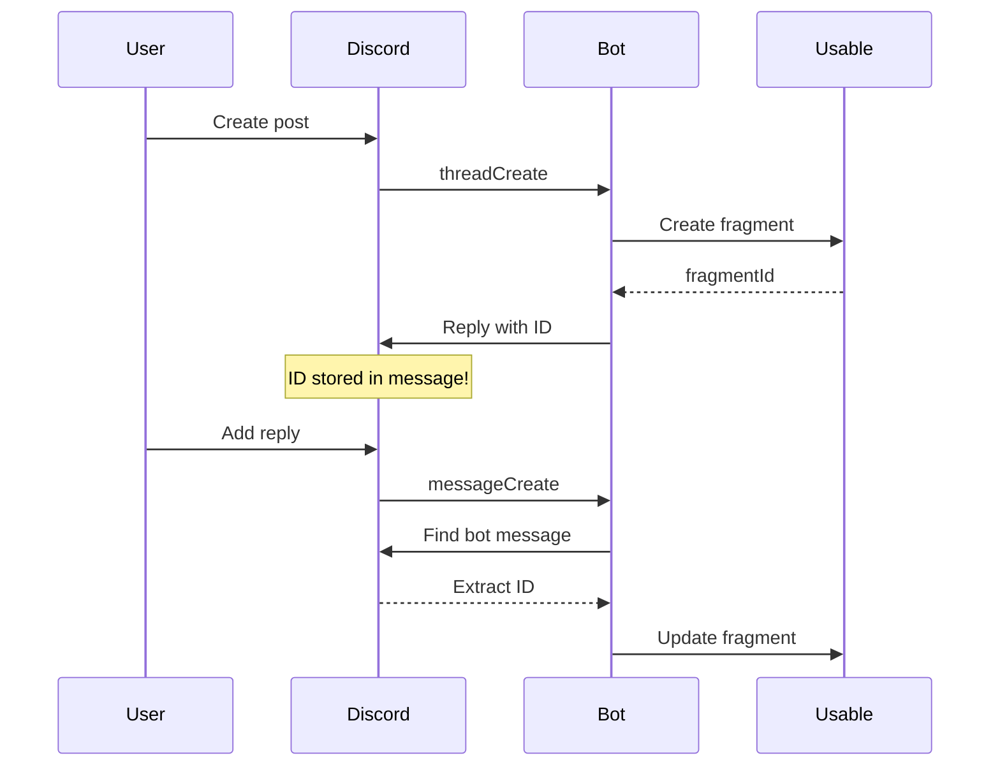

# Building a Production-Ready Discord Bot for Usable

> **Category:** Tutorials | **Difficulty:** Advanced | **Last Updated:** 2025-10-16

## Overview

Build a production-ready Discord bot that syncs forum posts to Usable with real-time updates and **zero database infrastructure**. This advanced guide covers database-free architecture, event-driven design, and full conversation tracking.

**This builds on our [basic integration guide](c108a50e-5ef7-4841-ad44-3b90ef9babe8).** Complete that first if you're new to Discord bots.

### What You'll Learn

- **Database-free architecture** using Discord as storage
- **Event-driven design** with clean handler separation
- **Real-time updates** for conversations, tags, and titles
- **Flexible forum mapping** to fragment types
- **Production patterns** for logging and validation
- **Type-safe development** with TypeScript and Zod

### Production-Ready Features

✅ **No Database** - Discord stores fragment IDs  
✅ **Real-Time Syncing** - Updates as conversations evolve  
✅ **Graceful Errors** - Bot continues running after failures  
✅ **Structured Logging** - JSON logs for monitoring  
✅ **Type Safety** - TypeScript + Zod validation  
✅ **Flexible Config** - JSON forum-to-fragment mapping  

### Prerequisites

- TypeScript/JavaScript proficiency
- Discord server with admin access
- Usable account with API access
- Bun or Node.js 18+ installed
- Completed [basic integration](c108a50e-5ef7-4841-ad44-3b90ef9babe8)

### Estimated Time

⏱️ 2-3 hours to complete

---

## Key Concepts

### Database-Free Architecture

**Traditional:**  
`Discord → Bot → Database (stores IDs) → Usable`

**Our approach:**  
`Discord (bot message contains ID) → Bot → Usable`

**How it works:**
1. Bot creates fragment in Usable
2. Bot replies to Discord thread with fragment ID
3. When updates occur, bot searches its own messages
4. Extract fragment ID, update Usable

**Benefits:**
- ✅ Zero infrastructure
- ✅ Built-in redundancy (Discord's reliability)
- ✅ Simpler deployment
- ✅ Natural data locality

### Event-Driven Design

Three focused handlers instead of one monolith:

- **ThreadCreate** → Create fragment
- **ThreadUpdate** → Sync tags/title changes
- **MessageCreate** → Update conversation

Each handler: one responsibility, independently testable, no shared state.

### Real-Time Update Strategy

We use **full conversation replacement**:

```typescript
// ✅ Rebuild from source
fetchAllMessages() → format() → replaceFragment()

// ❌ Not this (complex diffs)
oldContent + newMessage
```

**Why?** Simpler logic, handles deleted messages, always consistent.

---

## Project Structure

```
usable-discord-bot/
├── src/
│   ├── config/
│   │   └── env.ts                  # Zod validation
│   ├── handlers/
│   │   ├── ready.handler.ts
│   │   ├── thread-create.handler.ts
│   │   ├── thread-update.handler.ts
│   │   └── message-create.handler.ts
│   ├── services/
│   │   └── usable-api.service.ts
│   ├── types/
│   │   ├── discord.ts
│   │   └── usable.ts
│   ├── utils/
│   │   └── logger.ts
│   ├── bot.ts
│   └── index.ts
├── .env
├── package.json
└── tsconfig.json
```

---

## Quick Start

### 1. Install Dependencies

```bash
bun add discord.js axios zod
bun add -d @types/node typescript biome
```

### 2. Configure Environment

`.env`:
```env
DISCORD_BOT_TOKEN=your_token
DISCORD_CLIENT_ID=your_id
DISCORD_FORUM_MAPPINGS={"forumId":"fragmentTypeId"}
USABLE_API_KEY=your_key
USABLE_WORKSPACE_ID=your_workspace_id
```

### 3. Environment Validation

`src/config/env.ts`:
```typescript
import { z } from 'zod';

const forumMappingSchema = z.record(z.string(), z.string().uuid());

const envSchema = z.object({
  DISCORD_BOT_TOKEN: z.string().min(1),
  DISCORD_FORUM_MAPPINGS: z.string().transform((str) => 
    forumMappingSchema.parse(JSON.parse(str))
  ),
  USABLE_API_KEY: z.string().min(1),
  USABLE_WORKSPACE_ID: z.string().uuid(),
});

export const env = envSchema.parse(process.env);

export function isForumTracked(id: string): boolean {
  return id in env.DISCORD_FORUM_MAPPINGS;
}

export function getFragmentTypeForForum(id: string): string | null {
  return env.DISCORD_FORUM_MAPPINGS[id] || null;
}
```

### 4. Structured Logger

`src/utils/logger.ts`:
```typescript
class Logger {
  private log(level: string, message: string, context?: Record<string, unknown>) {
    console.log(JSON.stringify({
      level,
      timestamp: new Date().toISOString(),
      message,
      ...context,
    }));
  }

  error(msg: string, ctx?: Record<string, unknown>) { this.log('error', msg, ctx); }
  info(msg: string, ctx?: Record<string, unknown>) { this.log('info', msg, ctx); }
  debug(msg: string, ctx?: Record<string, unknown>) { this.log('debug', msg, ctx); }
}

export const logger = new Logger();
```

### 5. Types

`src/types/discord.ts`:
```typescript
export const GUILD_FORUM = 15;
```

`src/types/usable.ts`:
```typescript
export interface CreateFragmentRequest {
  title: string;
  content: string;
  workspaceId: string;
  fragmentTypeId: string;
  tags?: string[];
}

export interface CreateFragmentResponse {
  fragmentId: string;
  title: string;
}
```

### 6. Usable API Service

`src/services/usable-api.service.ts`:
```typescript
import axios, { type AxiosInstance } from 'axios';
import { env } from '../config/env.js';

export class UsableApiService {
  private client: AxiosInstance;

  constructor() {
    this.client = axios.create({
      baseURL: 'https://api.usable.dev/api',
      headers: {
        Authorization: `Bearer ${env.USABLE_API_KEY}`,
      },
    });
  }

  async createFragment(data: CreateFragmentRequest) {
    const response = await this.client.post('/memory-fragments', data);
    return response.data;
  }

  async updateFragment(fragmentId: string, data: { content?: string; tags?: string[] }) {
    await this.client.patch(`/memory-fragments/${fragmentId}`, data);
    return true;
  }

  formatThreadContent(author: string, content: string, meta: any): string {
    return `## Discord Thread

**Author:** ${author}
**Posted:** ${meta.timestamp}

---

${content}`;
  }

  generateTags(ctx: { guildName?: string; channelName?: string }): string[] {
    return ['discord', 'forum-post', `server:${ctx.guildName}`];
  }
}

export const usableApiService = new UsableApiService();
```

### 7. Thread Create Handler

`src/handlers/thread-create.handler.ts`:
```typescript
import type { ThreadChannel } from 'discord.js';
import { env, getFragmentTypeForForum, isForumTracked } from '../config/env.js';
import { usableApiService } from '../services/usable-api.service.js';
import { GUILD_FORUM } from '../types/discord.js';
import { logger } from '../utils/logger.js';

export async function handleThreadCreate(thread: ThreadChannel): Promise<void> {
  try {
    if (!thread.parent || thread.parent.type !== GUILD_FORUM) return;
    if (!thread.parentId || !isForumTracked(thread.parentId)) return;

    const fragmentTypeId = getFragmentTypeForForum(thread.parentId);
    if (!fragmentTypeId) return;

    const starterMessage = await thread.fetchStarterMessage();
    if (!starterMessage) return;

    const fragment = await usableApiService.createFragment({
      title: thread.name,
      content: usableApiService.formatThreadContent(
        starterMessage.author.username,
        starterMessage.content,
        { timestamp: starterMessage.createdAt }
      ),
      workspaceId: env.USABLE_WORKSPACE_ID,
      fragmentTypeId,
      tags: usableApiService.generateTags({ guildName: thread.guild.name }),
    });

    if (fragment) {
      await thread.send(
        `✅ **Registered in Usable!**
📝 Fragment ID: \`${fragment.fragmentId}\``
      );
      logger.info('Created fragment', { fragmentId: fragment.fragmentId });
    }
  } catch (error) {
    logger.error('Error creating fragment', { error });
  }
}
```

### 8. Message Create Handler

`src/handlers/message-create.handler.ts`:
```typescript
import type { Message } from 'discord.js';
import { isForumTracked } from '../config/env.js';
import { usableApiService } from '../services/usable-api.service.js';
import { GUILD_FORUM } from '../types/discord.js';
import { logger } from '../utils/logger.js';

export async function handleMessageCreate(message: Message): Promise<void> {
  if (message.author.bot || !message.channel.isThread()) return;

  const thread = message.channel;
  if (!thread.parent || thread.parent.type !== GUILD_FORUM) return;
  if (!thread.parentId || !isForumTracked(thread.parentId)) return;

  const fragmentId = await findFragmentIdInThread(thread, message.client.user?.id);
  if (!fragmentId) return;

  const conversation = await buildThreadConversation(thread);
  if (!conversation) return;

  await usableApiService.updateFragment(fragmentId, { content: conversation });
  logger.info('Updated fragment', { fragmentId });
}

async function findFragmentIdInThread(thread: any, botUserId?: string): Promise<string | null> {
  const messages = await thread.messages.fetch({ limit: 50 });
  const botMessage = messages.find(
    (msg: any) => msg.author.id === botUserId && msg.content.includes('Fragment ID:')
  );
  const match = botMessage?.content.match(/Fragment ID: \`([a-f0-9-]+)\`/i);
  return match ? match[1] : null;
}

async function buildThreadConversation(thread: any): Promise<string | null> {
  const messages = await thread.messages.fetch({ limit: 100 });
  const userMessages = messages
    .filter((msg: any) => !msg.author.bot)
    .sort((a: any, b: any) => a.createdTimestamp - b.createdTimestamp);

  return userMessages
    .map((msg: any) => `### ${msg.author.username}

${msg.content}`)
    .join('\n\n---\n\n');
}
```

### 9. Bot Class

`src/bot.ts`:
```typescript
import { Client, Events, GatewayIntentBits } from 'discord.js';
import { env } from './config/env.js';
import { handleMessageCreate } from './handlers/message-create.handler.js';
import { handleThreadCreate } from './handlers/thread-create.handler.js';

export class DiscordBot {
  private client: Client;

  constructor() {
    this.client = new Client({
      intents: [
        GatewayIntentBits.Guilds,
        GatewayIntentBits.GuildMessages,
        GatewayIntentBits.MessageContent,
      ],
    });

    this.client.on(Events.ThreadCreate, handleThreadCreate);
    this.client.on(Events.MessageCreate, handleMessageCreate);
  }

  async start() {
    await this.client.login(env.DISCORD_BOT_TOKEN);
  }

  async stop() {
    this.client.destroy();
  }
}
```

### 10. Entry Point

`src/index.ts`:
```typescript
import { DiscordBot } from './bot.js';

const bot = new DiscordBot();

process.on('SIGTERM', () => bot.stop());
process.on('SIGINT', () => bot.stop());

bot.start();
```

---

## Testing

```bash
# Start bot
bun run dev

# In Discord:
# 1. Create forum post
# 2. Bot replies with fragment ID
# 3. Check Usable for fragment
# 4. Reply to post
# 5. Check Usable for updated conversation
```

---

## Best Practices

### ✅ Do's

- Validate environment with Zod
- Use structured logging
- Handle errors gracefully
- Document your code
- Test locally first

### ❌ Don'ts

- Don't commit `.env`
- Don't hardcode IDs
- Don't ignore rate limits
- Don't delete bot messages

---

## Troubleshooting

### Bot doesn't respond

**Check:**
- Message Content Intent enabled in Discord Portal
- Forum in `DISCORD_FORUM_MAPPINGS`
- Bot has Read/Send message permissions

### Updates don't work

**Check:**
- Bot message not deleted
- Bot has Read Message History permission
- Fragment ID in bot message

---

## Architecture Diagrams

### Database-Free Flow



---

## Related Resources

- [Basic Discord Bot Integration](c108a50e-5ef7-4841-ad44-3b90ef9babe8) - Start here
- [Discord.js Guide](https://discordjs.guide) - Framework docs
- [Usable API Reference](https://usable.dev/docs/api) - API endpoints
- [Source Code](https://github.com/flowcore-io/usable-discord-bot) - Full implementation

---

## FAQs

**Q: Why no database?**  
**A:** Discord messages provide free, reliable storage with natural data locality.

**Q: What if bot message is deleted?**  
**A:** The link is lost. Updates won't work. Educate users not to delete bot messages.

**Q: Can I track multiple fragment types?**  
**A:** Yes! Map different forums to different types in `DISCORD_FORUM_MAPPINGS`.

---

**Footer Note:** This documentation is part of the Usable Public workspace.