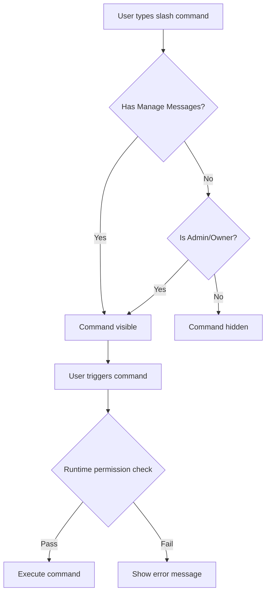

---

# Discord Bot Slash Commands: Complete Moderator Guide

> **Category:** Integrations - Discord | **Difficulty:** Beginner | **Last Updated:** October 17, 2025

## Overview

The Usable Discord Bot provides powerful slash commands for moderators to manually sync forum threads to your Usable workspace. These commands are only visible to users with "Manage Messages" permission, making them perfect for moderator workflows.

### What You'll Learn

- How to use all three slash commands effectively
- When and why to use manual sync vs automatic
- Permission requirements and setup
- Troubleshooting common issues
- Best practices for disaster recovery

### Prerequisites

- Access to a Discord server with the Usable Bot installed
- "Manage Messages" permission (or Administrator/Owner role)
- Basic familiarity with Discord's interface

### Estimated Time

⏱️ 5 minutes to learn, immediate results

---

## Commands Overview

The bot provides three slash commands for different sync scenarios:

| Command | Purpose | Use Case |
|---------|---------|----------|
| `/sync-forum` | Sync a specific thread | Fix failed sync, reprocess content |
| `/sync-all-tracked` | Bulk sync recent threads | Disaster recovery, catch-up after downtime |
| `/list-tracked` | Show configured forums | Verify setup, check tracking status |

---

## Command: `/sync-forum`

### Description
Sync a single forum thread to Usable. Perfect for fixing individual failed syncs or reprocessing updated content.

### Usage

**Auto-detect thread (recommended):**
```
/sync-forum
```
Run this command **inside** a forum thread. The bot will automatically detect which thread to sync.

**Explicit thread ID:**
```
/sync-forum thread_id:1234567890
```
Run from anywhere in the server by providing the thread ID manually.

**Force reprocess:**
```
/sync-forum force:true
```
Reprocess an already-synced thread (useful if content was updated).

### Parameters

| Parameter | Type | Required | Description |
|-----------|------|----------|-------------|
| `thread_id` | Text | No* | Discord thread ID (auto-detected if run in thread) |
| `force` | True/False | No | Reprocess already-synced threads (default: false) |

*Either run inside a thread OR provide `thread_id`

### Expected Output

✅ **Success:**
```
✅ Sync complete! Check the thread for the registration message.
```

The bot will also post its standard registration message in the thread with the Usable fragment link.

❌ **Failure:**
```
❌ Failed to sync thread

📝 Thread ID: `1234567890`

Possible reasons:
- Thread doesn't exist
- Thread is not in a forum
- Forum is not configured for tracking
- Thread already processed (use 'force: true' to reprocess)

Check bot logs for details.
```

### Common Use Cases

**Scenario 1: Failed Automatic Sync**
```
Problem: Thread was created but bot didn't register it
Solution: Open the thread, type /sync-forum, press Enter
Result: Thread synced retroactively
```

**Scenario 2: Content Updated After Sync**
```
Problem: Original post was edited significantly
Solution: /sync-forum force:true (in the thread)
Result: Fragment updated in Usable
```

**Scenario 3: Manual Historical Import**
```
Problem: Old threads need to be added to Usable
Solution: For each thread: /sync-forum thread_id:<id>
Result: Historical threads imported one by one
```

---

## Command: `/sync-all-tracked`

### Description
Bulk sync recent threads from configured forums. Essential for disaster recovery when multiple threads need processing.

### Usage

**Sync all forums (last 24 hours):**
```
/sync-all-tracked
```

**Sync specific forum:**
```
/sync-all-tracked forum_id:1234567890
```

**Extend time window:**
```
/sync-all-tracked max_age_hours:72
```

**Preview without processing (dry run):**
```
/sync-all-tracked dry_run:true
```

**Full custom sync:**
```
/sync-all-tracked forum_id:1234567890 max_age_hours:168 limit:100 dry_run:false
```

### Parameters

| Parameter | Type | Required | Default | Max | Description |
|-----------|------|----------|---------|-----|-------------|
| `forum_id` | Text | No | All forums | - | Specific forum channel ID |
| `max_age_hours` | Number | No | 24 | 720 | Look back this many hours |
| `limit` | Number | No | 50 | 200 | Max threads per forum |
| `dry_run` | True/False | No | false | - | Preview without processing |

### Expected Output

✅ **Success with no issues:**
```
✅ Sync Complete

📊 Results for All configured forums
• Scanned: 45 threads
• Unprocessed: 3 threads
• Processed: 3 threads
• Skipped: 42 threads (already synced)
• Failed: 0 threads
```

⚠️ **Success with errors:**
```
⚠️ Sync Complete

📊 Results for Forum `1234567890`
• Scanned: 50 threads
• Unprocessed: 5 threads
• Processed: 4 threads
• Skipped: 45 threads (already synced)
• Failed: 1 threads

**Errors:**
• Thread `9876543210`: Unknown Message (retry later)
```

### Common Use Cases

**Scenario 1: Bot Downtime Recovery**
```
Problem: Bot was offline for 3 hours, missed several posts
Solution: /sync-all-tracked max_age_hours:4
Result: All missed threads processed
```

**Scenario 2: New Forum Configuration**
```
Problem: Just added a new forum to tracking, want to import history
Solution: /sync-all-tracked forum_id:<id> max_age_hours:168 limit:200
Result: Last week of posts imported (up to 200 threads)
```

**Scenario 3: Check What Would Sync (Preview)**
```
Problem: Want to see what needs syncing before running bulk operation
Solution: /sync-all-tracked dry_run:true
Result: Preview stats without actually processing
```

---

## Command: `/list-tracked`

### Description
Shows all forums currently configured for automatic tracking and syncing.

### Usage

```
/list-tracked
```

No parameters - just displays the current configuration.

### Expected Output

```
📋 Configured Forums (3)

These forums are tracked and can be synced:

• **Feature Requests**
  ├─ Forum ID: `1234567890`
  └─ Fragment Type: `a1b2c3d4-e5f6-7890-abcd-ef1234567890`

• **Bug Reports**
  ├─ Forum ID: `9876543210`
  └─ Fragment Type: `b2c3d4e5-f6a7-8901-bcde-f23456789012`

• **Help & Support**
  ├─ Forum ID: `5555555555`
  └─ Fragment Type: `c3d4e5f6-a7b8-9012-cdef-345678901234`

_Only these forums will be synced. Other forums are ignored._
```

### Common Use Cases

**Scenario 1: Verify Configuration**
```
Problem: Not sure if a forum is tracked
Solution: /list-tracked
Result: See all tracked forums and confirm setup
```

**Scenario 2: Get Forum IDs**
```
Problem: Need forum ID for /sync-all-tracked command
Solution: /list-tracked
Result: Copy the forum ID from the output
```

---

## Permission Management

### Who Can Use These Commands?

Commands are **only visible** to users with one of:
- **"Manage Messages"** permission ✅ (recommended)
- **Administrator** role
- **Server Owner**

### How to Grant Access

**Option 1: Via Role Settings**
1. Server Settings → Roles
2. Select the moderator role
3. Permissions → Enable **"Manage Messages"**
4. Save changes

**Option 2: Via Channel Overrides**
1. Right-click channel → Edit Channel
2. Permissions → Select role
3. Enable **"Manage Messages"** for that channel
4. Save changes

### Why "Manage Messages"?

This permission is typically granted to moderators for:
- Pinning important messages
- Deleting spam or inappropriate content
- Managing forum posts
- **Bot moderation commands** ✅

It's powerful enough for moderation tasks but doesn't grant dangerous permissions like banning users or deleting channels.

### Understanding Visibility

**Regular users without permission:**
- Won't see these commands in their slash command list
- Can't trigger them even if they know the command name

**Moderators with "Manage Messages":**
- See all three commands in autocomplete
- Can execute them successfully

**Exceptions (always see commands):**
- Server owners (have all permissions by default)
- Users with Administrator role (bypasses permission checks)

---

## Best Practices

### ✅ Do's

- **Always try auto-detect first:** Run `/sync-forum` inside threads when possible
- **Use dry_run for bulk operations:** Preview before committing to large syncs
- **Start with smaller time windows:** Use 24-48 hours first, extend if needed
- **Monitor results:** Check the output stats to verify success
- **Use `/list-tracked` before bulk sync:** Confirm you're syncing the right forums
- **Check thread for registration:** Look for the bot's message confirming sync

### ❌ Don'ts  

- **Don't spam commands:** Give each command time to complete (can take 10-30 seconds)
- **Don't sync untracked forums:** Use `/list-tracked` to verify first
- **Don't use excessive `max_age_hours`:** Start small, increase if needed
- **Don't force reprocess unnecessarily:** Only use `force:true` for updated content
- **Don't sync while bot is processing:** Wait for deferred replies to complete

### 💡 Tips

- **Thread ID location:** Right-click thread → Copy ID (requires Developer Mode)
- **Enable Developer Mode:** User Settings → Advanced → Developer Mode
- **Check bot logs:** Ask admins to check Groundcover logs for detailed errors
- **Ephemeral responses:** Only you see command results - keeps channels clean
- **Combine with automatic sync:** These are backup/recovery tools, not replacements

---

## Troubleshooting

### Issue: Commands Not Visible

**Symptoms:** Can't see slash commands in autocomplete

**Cause:** Missing "Manage Messages" permission

**Solution:**
1. Check your roles in Server Settings
2. Verify "Manage Messages" is enabled
3. If you have it but still can't see commands, contact server owner
4. Note: Server owners and admins always see all commands

**Prevention:** Ensure moderator roles have proper permissions before onboarding

---

### Issue: "Thread doesn't exist" Error

**Symptoms:** `/sync-forum` fails with "Thread doesn't exist"

**Cause:** 
- Thread was deleted
- Thread ID is incorrect (typo)
- Thread is archived and bot can't access it

**Solution:**
```bash
1. Verify thread still exists (visit it in Discord)
2. Double-check thread ID (right-click → Copy ID)
3. If archived, unarchive it first
4. Try command again
```

**Prevention:** Sync threads soon after creation, avoid syncing very old archived threads

---

### Issue: "Forum is not configured" Error

**Symptoms:** Thread sync fails, says forum not tracked

**Cause:** The forum this thread belongs to isn't in `DISCORD_FORUM_MAPPINGS`

**Solution:**
```bash
1. Run /list-tracked to see configured forums
2. If your forum isn't listed, contact bot administrator
3. Admin needs to add forum to environment configuration
4. After configuration, threads can be synced
```

**Prevention:** Use `/list-tracked` to verify forum is tracked before bulk operations

---

### Issue: "Already Synced" When It Shouldn't Be

**Symptoms:** Thread won't sync, says already processed, but no registration message visible

**Cause:** Bot successfully processed it before, but registration message was deleted

**Solution:**
```bash
/sync-forum force:true
```
This will reprocess the thread and post a new registration message.

**Prevention:** Don't delete bot messages - they serve as sync markers

---

### Issue: Bulk Sync Taking Too Long

**Symptoms:** `/sync-all-tracked` seems stuck

**Cause:** Processing many threads takes time (especially with Discord API rate limits)

**Solution:**
- Wait patiently - bot shows "thinking" indicator
- Typical times: 10-30 seconds for 50 threads
- If > 2 minutes, check bot logs for errors
- Try smaller `limit` or shorter `max_age_hours`

**Prevention:** Start with defaults (50 threads, 24 hours), scale up gradually

---

### Issue: "Unknown Message" Errors in Bulk Sync

**Symptoms:** Some threads fail with "Unknown Message" error

**Cause:** Discord API eventual consistency - messages not immediately available

**Solution:**
- Wait 5-10 minutes, try again
- Bot has automatic retry logic but sometimes needs manual retry
- Use `/sync-forum thread_id:<id>` for individual retry

**Prevention:** Normal behavior, not preventable, just retry failed threads

---

## Diagrams

### Command Selection Flow

```mermaid
graph TD
    A[Need to sync?] -->|Single thread| B{Inside thread?}
    A -->|Multiple threads| C[/sync-all-tracked]
    A -->|Check config| D[/list-tracked]
    B -->|Yes| E[/sync-forum]
    B -->|No| F[/sync-forum thread_id:xxx]
    C --> G{Preview first?}
    G -->|Yes| H[dry_run:true]
    G -->|No| I[Run sync]
```

### Permission Check Flow



---

## API Reference

### Command Definitions

#### `/sync-forum`

**Signature:**
```typescript
/sync-forum [thread_id: string] [force: boolean]
```

**Parameters:**
- `thread_id` (optional): Discord snowflake ID
- `force` (optional, default: false): Reprocess already-synced threads

**Returns:** Ephemeral message with sync status

**Permissions Required:** `ManageMessages`

---

#### `/sync-all-tracked`

**Signature:**
```typescript
/sync-all-tracked [forum_id: string] [max_age_hours: number] [limit: number] [dry_run: boolean]
```

**Parameters:**
- `forum_id` (optional): Discord channel ID (forum)
- `max_age_hours` (optional, default: 24, max: 720): Time window in hours
- `limit` (optional, default: 50, max: 200): Max threads per forum
- `dry_run` (optional, default: false): Preview mode

**Returns:** Ephemeral message with detailed stats

**Permissions Required:** `ManageMessages`

---

#### `/list-tracked`

**Signature:**
```typescript
/list-tracked
```

**Parameters:** None

**Returns:** Ephemeral message with configured forums list

**Permissions Required:** `ManageMessages`

---

## Related Resources

### Documentation
- [Discord Bot Setup Guide](https://usable.tools/docs/discord-setup) - Initial bot installation
- [Forum Mapping Configuration](https://usable.tools/docs/forum-config) - Configure tracked forums
- [Usable Fragments Overview](https://usable.tools/docs/fragments) - Understanding fragments

### Tutorials
- [Disaster Recovery Playbook](https://usable.tools/tutorials/disaster-recovery) - Handling outages
- [Bulk Import Historical Threads](https://usable.tools/tutorials/bulk-import) - Import old content

### External Resources
- [Discord Developer Mode](https://support.discord.com/hc/en-us/articles/206346498) - Enable to copy IDs
- [Discord Permissions Guide](https://support.discord.com/hc/en-us/articles/206029707) - Understanding roles

---

## Real-World Examples

### Example 1: Quick Single Thread Fix

**Scenario:** User reports their bug report wasn't synced

**Steps:**
1. Navigate to the bug report thread
2. Type `/sync-forum`
3. Press Enter
4. Wait for ✅ confirmation
5. Verify registration message appears

**Time:** < 10 seconds

---

### Example 2: Post-Downtime Recovery

**Scenario:** Bot was down for 6 hours, need to catch up

**Steps:**
1. Type `/sync-all-tracked max_age_hours:7 dry_run:true`
2. Review preview stats
3. If looks good: `/sync-all-tracked max_age_hours:7 dry_run:false`
4. Wait for completion
5. Check for failed threads in output
6. Manually retry any failures with `/sync-forum thread_id:xxx`

**Time:** 30-60 seconds

---

### Example 3: New Forum Historical Import

**Scenario:** Just configured new forum, want last 30 days

**Steps:**
1. `/list-tracked` to get forum ID
2. `/sync-all-tracked forum_id:<id> max_age_hours:720 limit:200 dry_run:true`
3. Review preview (might need multiple batches if > 200 threads)
4. Run without dry_run: `/sync-all-tracked forum_id:<id> max_age_hours:720 limit:200`
5. If needed, adjust `max_age_hours` and repeat for older content

**Time:** 1-2 minutes per batch

---

## Changelog

### Version 1.0.0 (October 17, 2025)
- ✨ Initial release of slash commands
- 🎯 Auto-detection for `/sync-forum` in threads
- 🔐 Permission-based visibility and access control
- 📊 Detailed stats for bulk operations
- 🧪 Dry run mode for safe previews
- 📝 Comprehensive error messages

---

**Footer Note:** This documentation is part of the Usable Public workspace and is automatically synced to the docs site.

---

## Quick Reference Card

```
┌─────────────────────────────────────────────┐
│         USABLE BOT SLASH COMMANDS           │
├─────────────────────────────────────────────┤
│ 🎯 Single Thread                            │
│    /sync-forum                              │
│    (run inside thread)                      │
├─────────────────────────────────────────────┤
│ 🔄 Bulk Sync (last 24h)                     │
│    /sync-all-tracked                        │
├─────────────────────────────────────────────┤
│ 📋 List Tracked Forums                      │
│    /list-tracked                            │
├─────────────────────────────────────────────┤
│ 🔐 Permission Required                      │
│    "Manage Messages"                        │
└─────────────────────────────────────────────┘
```