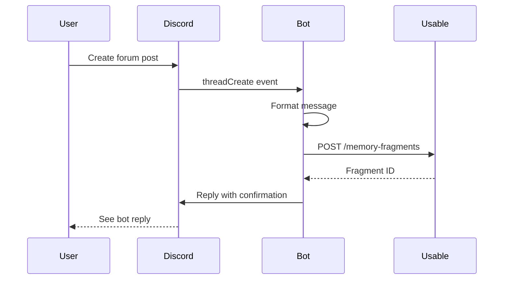
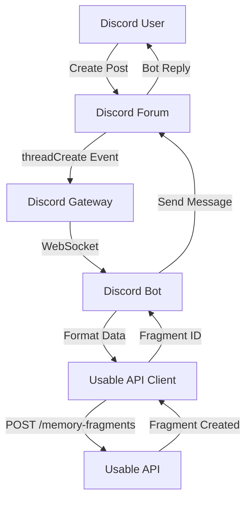
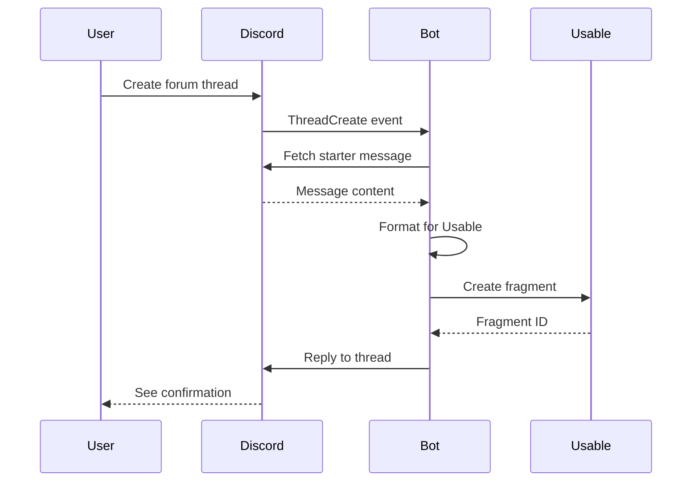

---

# How to Connect a Discord Bot to Usable

> **Category:** Integrations | **Difficulty:** Intermediate | **Last Updated:** 2025-10-16

## Overview

Learn how to build a Discord bot that automatically creates Usable memory fragments from Discord forum posts. This integration enables seamless knowledge management, turning Discord discussions into searchable, organized documentation.

### What You'll Learn

- Set up a Discord bot application with proper permissions
- Integrate Usable's API for fragment creation
- Listen for Discord forum thread events
- Format Discord messages for Usable storage
- Deploy the bot to production

### Prerequisites

- Basic TypeScript/JavaScript knowledge
- Discord account with server admin access
- Usable account with API access
- Node.js or Bun installed
- Understanding of REST APIs

### Estimated Time

⏱️ 30-45 minutes to complete

---

## Concepts

### Discord Bot Architecture

A Discord bot is a program that:
1. Connects to Discord's Gateway (WebSocket connection)
2. Listens for events (messages, threads, reactions)
3. Responds to events by performing actions
4. Runs continuously (24/7)

### Usable Memory Fragments

Memory fragments are the core knowledge unit in Usable:
- **Title:** Brief description
- **Content:** Full text with markdown formatting
- **Tags:** For organization and search
- **Type:** Classification (issue, knowledge, recipe, etc.)
- **Workspace:** Where the fragment is stored

### Integration Flow



### Key Terminology

| Term | Definition |
|------|------------|
| Guild | Discord server (API terminology) |
| Thread | Discussion within a forum channel |
| Gateway | WebSocket connection to Discord |
| Fragment | Knowledge unit in Usable |
| OAuth2 | Discord's authorization system |
| Intent | Permission to receive specific events |

---

## Tutorial / How-To

### Step 1: Create Discord Bot Application

1. Go to [Discord Developer Portal](https://discord.com/developers/applications)
2. Click **"New Application"**
3. Name it "Usable Bot" (or your preference)
4. Click **"Create"**

**What this does:** Creates your bot application container that holds credentials and settings.

### Step 2: Configure Bot Settings

1. Navigate to the **"Bot"** section in left sidebar
2. Click **"Add Bot"** → **"Yes, do it!"**
3. Under **"Token"**, click **"Reset Token"** and **copy it** (save for later)
4. Enable **Privileged Gateway Intents:**
   - ☑️ **Message Content Intent** (required)
   - ☑️ **Server Members Intent** (optional)
5. Click **"Save Changes"**

**Why this matters:** Message Content Intent allows your bot to read message text, which is essential for creating fragments.

### Step 3: Generate Bot Invite URL

1. Go to **"OAuth2"** → **"URL Generator"**
2. Select **Scopes:**
   - ☑️ `bot`
3. Select **Bot Permissions:**
   - ☑️ View Channels
   - ☑️ Send Messages
   - ☑️ Send Messages in Threads
   - ☑️ Read Message History
4. Copy the **Generated URL** at the bottom
5. Open URL in browser and add bot to your test server

**Expected result:** Bot appears in your server's member list (offline until you run the code).

### Step 4: Get Usable API Credentials

1. Log in to [Usable](https://usable.dev)
2. Navigate to **Settings** → **API Keys**
3. Click **"Generate New Key"**
4. Copy the API key (starts with `usa_key_...`)
5. Copy your **Workspace ID** from workspace settings

**Security note:** Never commit API keys to git. Use environment variables.

### Step 5: Set Up Project

**Create project directory:**

```bash
mkdir usable-discord-bot
cd usable-discord-bot
```

**Initialize with Bun (recommended):**

```bash
bun init -y
bun add discord.js axios zod
bun add -d @types/node typescript
```

**Or with npm:**

```bash
npm init -y
npm install discord.js axios zod
npm install -D @types/node typescript
```

### Step 6: Create Environment Configuration

Create `.env` file:

```bash
# Discord Configuration
DISCORD_BOT_TOKEN=your_bot_token_here
DISCORD_CLIENT_ID=your_client_id_here

# Usable API Configuration
USABLE_API_URL=https://api.usable.dev/api
USABLE_API_KEY=your_usable_api_key_here
USABLE_WORKSPACE_ID=your_workspace_id_here
USABLE_ISSUE_FRAGMENT_TYPE_ID=your_fragment_type_id_here

# Bot Configuration
NODE_ENV=development
LOG_LEVEL=info
```

**Get Fragment Type ID:**
1. In Usable, go to workspace settings
2. Navigate to Fragment Types
3. Copy the UUID for "Issue" type

### Step 7: Implement Usable API Client

Create `src/services/usable-api.service.ts`:

```typescript
import axios, { AxiosInstance } from 'axios';

export class UsableApiService {
  private client: AxiosInstance;

  constructor() {
    this.client = axios.create({
      baseURL: process.env.USABLE_API_URL,
      headers: {
        Authorization: `Bearer ${process.env.USABLE_API_KEY}`,
        'Content-Type': 'application/json',
      },
    });
  }

  async createFragment(data: {
    title: string;
    content: string;
    workspaceId: string;
    fragmentTypeId: string;
    tags?: string[];
  }) {
    const response = await this.client.post('/memory-fragments', data);
    return response.data;
  }
}

export const usableApi = new UsableApiService();
```

**Explanation:**
- Line 6-12: Initialize axios client with Usable API URL and auth header
- Line 14-22: Create fragment method that POSTs to Usable API
- Line 25: Export singleton instance for easy imports

### Step 8: Create Discord Bot

Create `src/bot.ts`:

```typescript
import { Client, GatewayIntentBits, Events } from 'discord.js';
import { usableApi } from './services/usable-api.service';

const client = new Client({
  intents: [
    GatewayIntentBits.Guilds,
    GatewayIntentBits.GuildMessages,
    GatewayIntentBits.MessageContent,
  ],
});

// Bot ready event
client.once(Events.ClientReady, (c) => {
  console.log(`✅ Bot is ready! Logged in as ${c.user.tag}`);
});

// Listen for new threads in forum channels
client.on(Events.ThreadCreate, async (thread) => {
  // Only process forum threads
  if (!thread.parent || thread.parent.type !== 15) return;

  try {
    // Fetch starter message
    const starterMessage = await thread.fetchStarterMessage();
    
    // Create Usable fragment
    const fragment = await usableApi.createFragment({
      title: thread.name,
      content: `## Discord Forum Post\n\n**Author:** ${starterMessage.author.username}\n**Server:** ${thread.guild.name}\n**Channel:** ${thread.parent.name}\n\n---\n\n${starterMessage.content}`,
      workspaceId: process.env.USABLE_WORKSPACE_ID!,
      fragmentTypeId: process.env.USABLE_ISSUE_FRAGMENT_TYPE_ID!,
      tags: ['discord', 'forum-post', `server:${thread.guild.name}`],
    });

    // Reply to thread
    await thread.send(
      `✅ **Issue registered in Usable!**\n📝 Fragment ID: \`${fragment.fragmentId}\`\n📌 Title: ${fragment.title}`
    );
  } catch (error) {
    console.error('Error:', error);
    await thread.send('❌ Failed to register issue in Usable.');
  }
});

// Login to Discord
client.login(process.env.DISCORD_BOT_TOKEN);
```

**Explanation:**
- Line 4-10: Initialize Discord client with required intents
- Line 17-43: Listen for forum thread creation events
- Line 19: Filter to only forum channels (type 15)
- Line 23: Fetch the first message in the thread
- Line 26-32: Create Usable fragment with formatted content
- Line 35-37: Reply to thread with confirmation

### Step 9: Run the Bot

**Development:**

```bash
bun run src/bot.ts
```

**Expected output:**

```
✅ Bot is ready! Logged in as Usable Bot#1234
```

### Step 10: Test the Integration

1. Go to your Discord server
2. Create a **Forum Channel** if you don't have one
3. Create a new **Forum Post**:
   - Title: "Test: Integration Works"
   - Message: "Testing Usable integration!"
4. Wait 2-3 seconds
5. Bot should reply with fragment ID

**Expected bot reply:**

```
✅ Issue registered in Usable!
📝 Fragment ID: `abc123-def456-...`
📌 Title: Test: Integration Works
```

6. Go to Usable and search for the fragment
7. Verify it contains the Discord context

---

## Code Examples

### Basic Example

**Scenario:** Minimal bot that creates fragments from forum posts

```typescript
import { Client, GatewayIntentBits } from 'discord.js';
import axios from 'axios';

const client = new Client({
  intents: [
    GatewayIntentBits.Guilds,
    GatewayIntentBits.MessageContent,
  ],
});

client.on('threadCreate', async (thread) => {
  if (thread.parent?.type === 15) { // Forum channel
    const msg = await thread.fetchStarterMessage();
    
    await axios.post(
      'https://api.usable.dev/api/memory-fragments',
      {
        title: thread.name,
        content: msg.content,
        workspaceId: 'your-workspace-id',
        fragmentTypeId: 'your-fragment-type-id',
      },
      {
        headers: {
          Authorization: `Bearer ${process.env.USABLE_API_KEY}`,
        },
      }
    );
  }
});

client.login(process.env.DISCORD_BOT_TOKEN);
```

### Advanced Example with Error Handling

**Scenario:** Production-ready implementation with retry logic

```typescript
import { Client, ThreadChannel } from 'discord.js';
import axios, { AxiosError } from 'axios';

async function createFragmentWithRetry(
  data: FragmentData,
  retries = 3
): Promise<Fragment> {
  for (let i = 0; i < retries; i++) {
    try {
      const response = await axios.post(
        'https://api.usable.dev/api/memory-fragments',
        data,
        {
          headers: {
            Authorization: `Bearer ${process.env.USABLE_API_KEY}`,
          },
        }
      );
      return response.data;
    } catch (error) {
      if (i === retries - 1) throw error;
      await new Promise(resolve => setTimeout(resolve, 1000 * (i + 1)));
    }
  }
}

client.on('threadCreate', async (thread: ThreadChannel) => {
  try {
    const fragment = await createFragmentWithRetry({
      title: thread.name,
      content: await formatThreadContent(thread),
      workspaceId: process.env.USABLE_WORKSPACE_ID!,
      fragmentTypeId: process.env.USABLE_ISSUE_FRAGMENT_TYPE_ID!,
    });
    
    await thread.send(`✅ Created: ${fragment.fragmentId}`);
  } catch (error) {
    console.error('Failed after retries:', error);
    await thread.send('❌ Error creating fragment');
  }
});
```

---

## Common Patterns

### Pattern 1: Rich Metadata Formatting

**Use when:** You want to preserve Discord context in fragments

```typescript
function formatThreadContent(thread: ThreadChannel, message: Message): string {
  return `## Discord Thread Message

**Server:** ${thread.guild.name}
**Channel:** ${thread.parent?.name}
**Thread:** ${thread.name}
**Author:** ${message.author.username}
**Posted:** ${message.createdAt.toISOString()}

---

${message.content}`;
}
```

**Benefits:**
- Full context preserved
- Easy to search in Usable
- Clear formatting

### Pattern 2: Tag Generation

**Use when:** You want automatic, consistent tagging

```typescript
function generateTags(thread: ThreadChannel): string[] {
  const tags = ['discord', 'forum-post'];
  
  if (thread.guild.name) {
    tags.push(`server:${thread.guild.name.toLowerCase().replace(/\s+/g, '-')}`);
  }
  
  if (thread.parent?.name) {
    tags.push(`channel:${thread.parent.name.toLowerCase().replace(/\s+/g, '-')}`);
  }
  
  return tags;
}
```

---

## Configuration

### Required Environment Variables

| Variable | Type | Description |
|----------|------|-------------|
| `DISCORD_BOT_TOKEN` | string | Bot authentication token from Discord |
| `USABLE_API_KEY` | string | API key from Usable settings |
| `USABLE_WORKSPACE_ID` | string | Target workspace UUID |
| `USABLE_ISSUE_FRAGMENT_TYPE_ID` | string | Fragment type for issues |

### Optional Variables

| Variable | Type | Default | Description |
|----------|------|---------|-------------|
| `USABLE_API_URL` | string | `https://api.usable.dev/api` | Usable API endpoint |
| `LOG_LEVEL` | string | `info` | Logging verbosity |
| `NODE_ENV` | string | `development` | Environment mode |

---

## Diagrams

### Architecture Diagram



### Event Flow



---

## Best Practices

### ✅ Do's

- **Use environment variables** for all secrets
- **Validate data** before sending to Usable
- **Include error handling** for network failures
- **Log events** for debugging and monitoring
- **Format content** with Discord context
- **Test locally** before deploying

### ❌ Don'ts

- **Don't commit** `.env` files or secrets
- **Don't skip** Message Content Intent
- **Avoid blocking** the main thread with sync operations
- **Don't ignore** rate limits
- **Never** hardcode API keys in source code

### 💡 Tips

- **Use TypeScript** for type safety
- **Implement retry logic** for API calls
- **Add health checks** for monitoring
- **Store thread-to-fragment mapping** in a database for updates
- **Use structured logging** for production

---

## Troubleshooting

### Issue: Bot doesn't respond to forum posts

**Symptoms:**
- Bot shows as online
- No reply when creating forum threads
- No errors in console

**Cause:** Missing Message Content Intent or wrong channel type

**Solution:**

1. Check Discord Developer Portal → Bot → Privileged Gateway Intents
2. Ensure "Message Content Intent" is enabled
3. Verify forum channel type in code:

```typescript
if (thread.parent?.type !== 15) {
  console.log('Not a forum channel, skipping');
  return;
}
```

**Prevention:** Always enable required intents before launching bot

### Issue: Usable API returns 401 Unauthorized

**Symptoms:**
- Error: "Request failed with status code 401"
- Fragment not created
- Bot sends error message to Discord

**Cause:** Invalid or expired API key

**Solution:**

```bash
# Regenerate API key in Usable
# Update .env file
USABLE_API_KEY=usa_key_new_key_here

# Restart bot
```

**Prevention:** Use environment validation on startup

### Issue: Fragment created but missing content

**Symptoms:**
- Fragment exists in Usable
- Content field is empty or null
- Title is correct

**Cause:** Starter message fetch failed or returned null

**Solution:**

```typescript
const starterMessage = await thread.fetchStarterMessage();
if (!starterMessage) {
  console.error('Could not fetch starter message');
  return;
}
```

**Prevention:** Always validate fetched data before using it

---

## Performance Considerations

### Optimization Tips

- **Batch operations** if processing multiple threads
- **Cache fragment type IDs** to reduce API calls
- **Use connection pooling** for HTTP requests
- **Implement rate limiting** to avoid Discord/Usable API limits
- **Queue long-running tasks** instead of blocking

### Rate Limits

| Service | Limit | Notes |
|---------|-------|-------|
| Discord Gateway | 120 events/min | Per bot connection |
| Discord API | 50 requests/sec | Global rate limit |
| Usable API | 100 requests/min | Per API key |

---

## Real-World Examples

### Example 1: Support Forum Integration

**Scenario:** Customer support team uses Discord forum for issues

**Implementation:**

```typescript
client.on('threadCreate', async (thread) => {
  if (thread.parent?.name === 'customer-support') {
    const fragment = await usableApi.createFragment({
      title: `[Support] ${thread.name}`,
      content: formatSupportTicket(thread),
      workspaceId: process.env.USABLE_WORKSPACE_ID!,
      fragmentTypeId: process.env.USABLE_ISSUE_FRAGMENT_TYPE_ID!,
      tags: ['support', 'customer', thread.guild.name],
    });
    
    await thread.send(
      `🎫 Support ticket created!\nTicket ID: ${fragment.fragmentId}`
    );
  }
});
```

**Outcome:** All support requests automatically tracked in Usable, searchable by team

### Example 2: Feature Request Collection

**Scenario:** Community submits feature requests via Discord

**Implementation:**

```typescript
client.on('threadCreate', async (thread) => {
  if (thread.appliedTags?.includes('feature-request')) {
    await usableApi.createFragment({
      title: thread.name,
      content: formatFeatureRequest(thread),
      fragmentTypeId: process.env.USABLE_FEATURE_FRAGMENT_TYPE_ID!,
      tags: ['feature-request', 'community', 'discord'],
    });
  }
});
```

**Outcome:** Product team has organized list of community feature requests

---

## Related Resources

### Documentation

- [Discord.js Guide](https://discordjs.guide) - Official Discord.js documentation
- [Usable API Reference](https://usable.dev/docs/api) - Usable API endpoints
- [Discord Developer Portal](https://discord.com/developers/docs) - Discord API docs

### Tutorials

- [Building Discord Bots with TypeScript](https://link) - Getting started guide
- [Usable API Integration Patterns](https://link) - Best practices

### External Resources

- [Discord.js Discord Server](https://discord.gg/djs) - Community support
- [Usable Community](https://discord.gg/usable) - Get help

---

## FAQs

### Q: Can I update fragments when threads receive replies?

**A:** Yes! Store thread-to-fragment mapping in a database, then listen for `messageCreate` events in threads and update the corresponding fragment.

### Q: What fragment types should I use?

**A:** 
- Support tickets → "Issue" type
- Feature requests → "Feature Request" type  
- Documentation → "Knowledge" type
- Tutorials → "Recipe" type

### Q: How do I handle rate limits?

**A:** Implement a queue system with exponential backoff. Libraries like `bottleneck` or `p-queue` can help manage rate limits automatically.

### Q: Can I use this with Slack instead?

**A:** Yes! The Usable API integration part is the same. You'd just replace the Discord bot code with Slack's Bolt framework.

---

## Changelog

### Version 1.0.0 (2025-10-16)

- Initial documentation
- Complete tutorial from setup to deployment
- Code examples for common patterns
- Troubleshooting guide
- Production best practices

---

## Contributing

Found an issue or want to improve this documentation?

- Report issues in the Usable Public workspace
- Suggest improvements via Discord community
- Submit examples of your integration

---

**Footer Note:** This documentation is part of the Usable Public workspace and is automatically synced to the docs site.