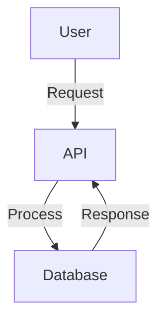

This template ensures consistent, webhook-ready documentation that can be automatically published to a docs site without manual adjustments.

## Template Structure

**⚠️ IMPORTANT: DO NOT include YAML frontmatter in fragment content!**

The n8n webhook workflow automatically generates frontmatter from fragment metadata (fragmentId, fragmentType, createdBy, createdAt, updatedAt, etc.). Including frontmatter in the fragment content will cause double frontmatter and break the Astro parser.

✅ **Correct:** Start directly with the H1 heading
❌ **Wrong:** Include `---` YAML frontmatter

The workflow will handle all metadata automatically.

## Required Sections

### 1. Title & Overview
```markdown
# [Title - Same as metadata]

> **Category:** [Category Name] | **Difficulty:** [Difficulty Level] | **Last Updated:** [Date]

## Overview
[2-3 sentence overview explaining what this document covers and why it matters]

### What You'll Learn
- Key point 1
- Key point 2
- Key point 3

### Prerequisites
- Prerequisite 1
- Prerequisite 2

### Estimated Time
⏱️ [X minutes/hours] to complete
```

### 2. Concepts (for explanatory docs)
```markdown
## Concepts
[Explain core concepts in clear, simple language]

### Key Terminology
| Term | Definition |
|------|------------|
| Term 1 | Clear definition |
| Term 2 | Clear definition |
```

### 3. Tutorial / How-To (for instructional docs)
```markdown
## Tutorial / How-To

### Step 1: [Action Title]
[Detailed explanation]

**Example:**
```language
// Code with comments
const example = "working code";
```

**Expected Output:**
```
What the user should see
```
```

### 4. Code Examples
```markdown
## Code Examples

### Basic Example
**Scenario:** [What this demonstrates]

```typescript
// Full, runnable example
import { Component } from 'package';

const example = new Component({
  option1: 'value1',
});
```

**Explanation:**
- Line 1-2: [What these do]
```

## Optional Sections

### Diagrams
Use Mermaid syntax for auto-rendering:

```markdown
## Diagrams

### Architecture Diagram

```

### API Reference
```markdown
## API Reference

### Method: `methodName()`
**Description:** [What it does]

**Signature:**
```typescript
function methodName(param: string): Promise<Result>
```

**Parameters:**
| Parameter | Type | Required | Description |
|-----------|------|----------|-------------|
| param | string | Yes | Purpose |

**Returns:** `Promise<Result>` - [What it returns]

**Example:**
```typescript
const result = await methodName('value');
```
```

### Troubleshooting
```markdown
## Troubleshooting

### Issue: [Common Problem]
**Symptoms:** [What user sees]
**Cause:** [Why this happens]
**Solution:**
```bash
command --fix
```
**Prevention:** [How to avoid]
```

### Best Practices
```markdown
## Best Practices

### ✅ Do's
- **Do this:** Why
- **Always:** Important

### ❌ Don'ts  
- **Don't do this:** Why problematic
- **Never:** Critical mistakes

### 💡 Tips
- **Tip 1:** Helpful optimization
```

### Related Resources
```markdown
## Related Resources

### Documentation
- [Related Doc 1](link) - Description
- [Related Doc 2](link) - Description

### Tutorials
- [Tutorial 1](link) - What it covers

### External Resources
- [Official Docs](link)
- [Community Guide](link)
```

## Category Definitions

| Category | Description | Example Topics |
|----------|-------------|----------------|
| **getting-started** | Onboarding and basics | Installation, Quick Start |
| **concepts** | Theoretical knowledge | Architecture, How it works |
| **tutorials** | Step-by-step guides | Build a feature, Integration |
| **api-reference** | Technical specifications | API endpoints, Methods |
| **integrations** | Third-party connections | Discord, Slack, GitHub |
| **troubleshooting** | Problem-solving | Common errors, Debugging |

## Difficulty Levels

- **Beginner:** No prior knowledge required
- **Intermediate:** Basic understanding assumed
- **Advanced:** Deep technical knowledge needed

## Writing Style Guidelines

1. **Be Clear:** Use simple language, explain jargon
2. **Be Concise:** Get to the point quickly
3. **Be Practical:** Include working examples
4. **Be Helpful:** Anticipate user questions

### Code Examples Best Practices

- Always use syntax highlighting
- Include comments explaining complex parts
- Provide complete, runnable examples
- Show expected output when relevant

### Diagram Best Practices

- Use Mermaid syntax for automatic rendering
- Include text descriptions for accessibility
- Keep diagrams simple and focused

## Webhook Metadata Structure

Include this JSON metadata for webhook processing:

```json
{
  "title": "Document Title",
  "category": "getting-started",
  "subcategory": "setup",
  "tags": ["tag1", "tag2", "tag3"],
  "difficulty": "beginner",
  "version": "1.0.0",
  "lastUpdated": "2025-10-16",
  "author": "Author Name",
  "estimatedTime": "10 minutes",
  "prerequisites": ["Pre 1", "Pre 2"],
  "relatedDocs": ["doc-id-1", "doc-id-2"]
}
```

## Section Priority

**Must Have:**
- Title & Metadata (frontmatter)
- Overview with "What You'll Learn"
- Main content (Tutorial OR Concepts)
- Related Resources

**Should Have:**
- Prerequisites
- Code Examples
- Best Practices

**Nice to Have:**
- Diagrams
- API Reference
- Troubleshooting
- FAQs
- Changelog

## Footer Template

```markdown
---
**Footer Note:** This documentation is part of the Usable Public workspace and is automatically synced to the docs site.
```

---

This template ensures all Usable Public documentation is:
✅ **Consistent** - Same structure across all docs
✅ **Webhook-Ready** - Metadata for auto-publishing
✅ **Comprehensive** - Covers all necessary information
✅ **Accessible** - Clear, well-organized content
✅ **Maintainable** - Easy to update and version